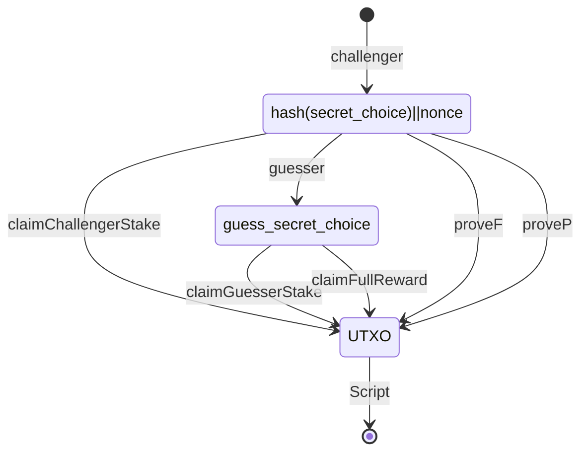

# ada-guess

`ada-guess` is a simple game inspired from the British television quiz show [Who Wants to Be a Millionaire?](https://en.wikipedia.org/wiki/Who_Wants_to_Be_a_Millionaire%3F_(British_game_show))
It consists of two players  -`C` the challenger and `G` the guesser. `C` chooses an option out of four possible choices `A`,`B`,`C`,`D` and challenges `G` to guess the secret choice. `G` can make two choices. For example 'A, B' means that `G` thinks option `A` is most likely the correct answer and if not, then falls back to option `B`. The three possible outcomes are tabularized below:

| Challenger  |  Guesser    |    Result     |
| :---        |    :----:   |          ---: |
|    `A`      |    `A, B`   |    `G` wins   |
|    `B`      |    `A, B`   |    `DRAW`     |
|    `C`      |    `B, D`   |    `C` wins   |


The distribution of the rewards are based on the following rules:
* In case of a successful first attempt, `G` wins and claims the entire `ADA` locked to the contract script. 
* In case of a successful second attempt, `C` and `G` can claim their own respective stake back. 
* Otherise, `C` wins and claims the entire `ADA` locked to the contract script.

As one can infer, both `C` and `G` have 25% probability of winning the game and 50% chance of claiming their original stake.

## Game Flow



## How `ada-guess` works?

* Once the challenge is initiated, `G` must respond within a certain deadline known as the guess deadline. If `G` does not respond within this
  time, then `C` can claim his/her own stake back `claimChallengerStake`.
* Incase, both the choices of `G` are wrong, `C` must provide a valid proof to the blockchain `proveF` within a certain deadline known as the prove deadline to unlock the entire reward.
* Incase, only the first choice of `G` is wrong, then `C` still must provide a valid proof to the blockchain `proveP` within prove deadline to unlock his/her own stake back. 
* Incase, `C` does not respond after `G` makes the guess, `G` can unlock the entire reward anytime after the prove deadline.


## Code

A brief description of how the source code of `ada-guess` can be found [here.](https://github.com/srinathLN7/cdp/tree/main/src) 

## Run

Open `nix-shell` from the `plutus-apps`  directory and use `Week07` from the `plutus-pioneer-program`.

```

cd plutus-apps 

-- checkout Weeok07 PPP commit
git checkout 13836ecf5

nix-shell

```

once the `nix-shell` is built, execute the following commands

```

cd $<YOUR_CDP_PROJECT_PATH>

cabal update

cabal repl

```

After executing the above commands both the modules in the `src` directory will be loaded. 
To test the contract using emulator trace run

```

:l TestFiftyFifty

-- guesser wins
test' A A B 

-- game DRAW
test' A B A

--challenger wins
test' A B C

``` 

Both the challenger and guesser's wallet are initially loaded with `100 ada`. The output for all the three scenarios are listed below

|   Input  	 |    Result   	 |            Final Balances     		|
|     :---       |    :----:     |          ---: 	 			|
|  `test' A A B` |    `G` wins   |	{`C` : 901999990,  `G`: 1097981422}	|
|  `test' A B A` |    `DRAW`     |	{`C` : 1001990701, `G`: 997981422}	|
|  `test' A B C` |    `C` wins   |	{`C` : 1099990701, `G`: 899990711}	|


Note that in all three cases, the NFT minted by the challenger at the start of the game to identify the UTXOs uniquely is always returned back to the challenger.

## e-UTXO model flow


