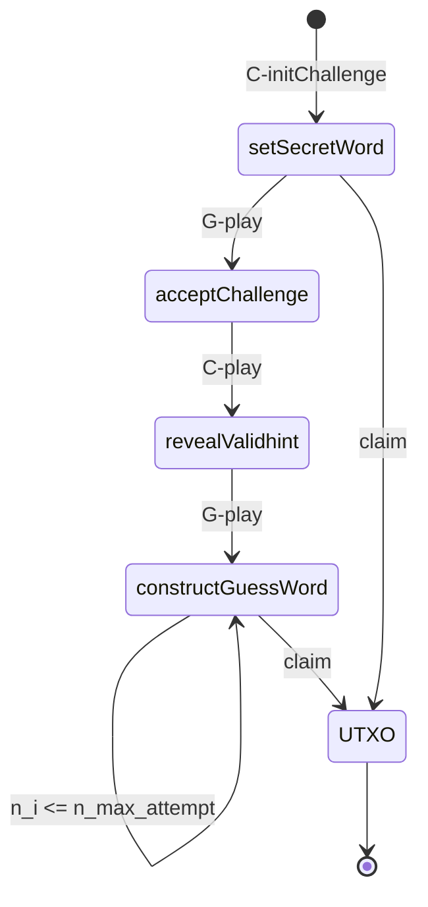

# ada-guess

`ada-guess` is a simple game consisting of two players - `Challenger` and `Guesser`. The challenger sets a *valid* guess word constructed with the use of english alphabets and locks a certain amount of `ADA` to the contract script. The guesser accepts the challenge proposed and puts equal amount of `ADA` to the script to take the challenge. Once the challenge is accepted, the challenger throws a *valid* hint to guess the word correctly. Depending on the game progress the contract distributes the rewards accordingly. 

## Rules

Both the players are bounded by a certain time deadline. In case the deadline is not met, the opponent can unlock all the rewards.

### Challenger
* The guessing word should consist of a minimum of 6 and a maximum of 16 letters.
* A hint is considered valid if it satisfies the following rules:
	- min of 3 letters if guess word length is between 6 and 8
	- min of 4 letters if guess word length is between 9 and 12
	- min of 6 letters if guess word length is between 12 and 16
	
### Guesser
* Only two guess attempts can be made.

### Rewards distribution

The distribution of the rewards are based on the following rules:
* Upon correct guess in the first attempt, the guesser gets the entire `ADA` locked to the contract script. 
* In case of a successful second attempt, the guesser gets his stake back. 
* Otherise, the challenger wins the entire stake.

## Game Flow

